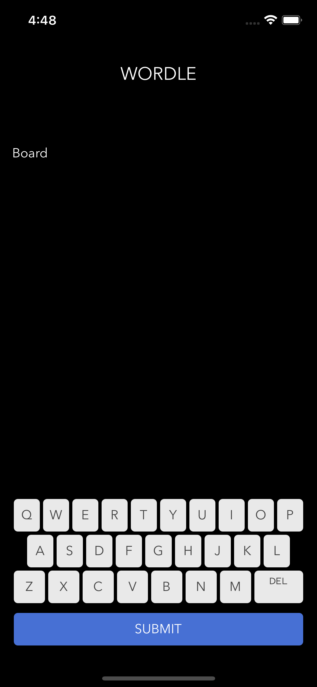
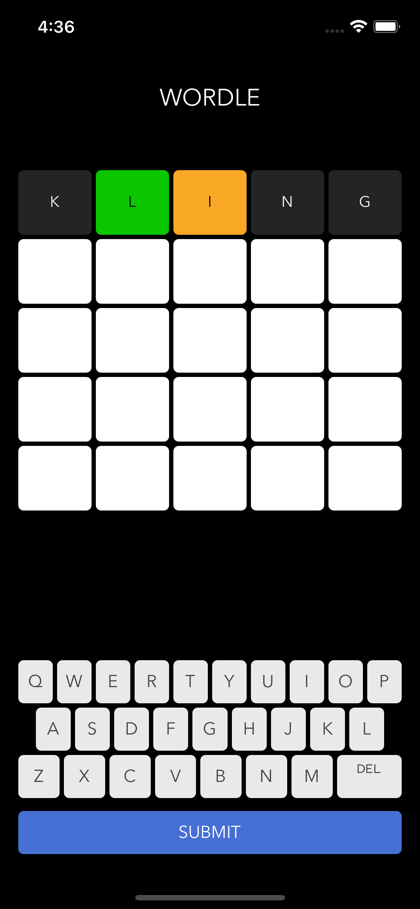
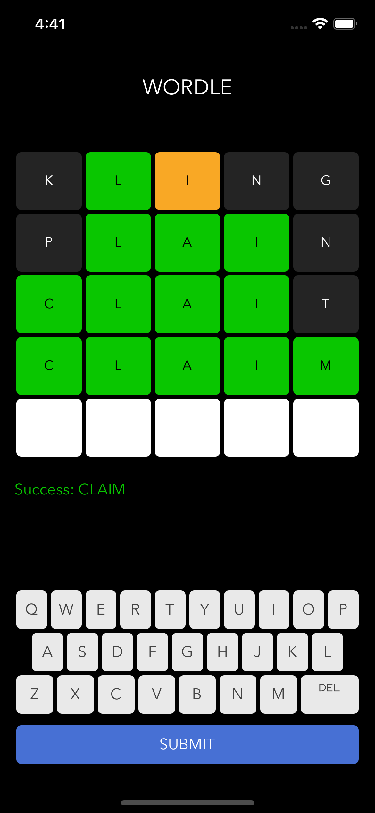

# Wordle

Wordle - The New York Times: Guess the WORDLE in six tries.

## Problem statement

- There is a list of 5-letter words. When game started, we pick random word from the list and player should guess it.
- Player has 5 attempts to guess the word
- After each guess, we have few cases to handle:

  - Word wasn't found in the list. Then we should show the message about it to user
  - User guessed the word. Showing congratulation message
  - Word exists in the list, but it's not the one, player is looking for. Then we need to check every letter. If player guessed leter and it's position - color it with green, if player guessed only letter, but no position - color it with yellow. If word doesn't contain this letter - color it with grey

- images below represent from initial state to desired solution

<p float="left">
  
  
  
</p>

---

## Included

- [React](https://github.com/facebook/react)
- [React Native](https://github.com/facebook/react-native)
- [Styled Components](https://github.com/styled-components/styled-components)


## Prerequisites

Make sure to have the following installed:

- Android Studio

You can use brew install for the following:

```bash
brew install yarn
brew install cocoapods
brew install node
brew install watchman
```

## Installation

See [Getting Started](https://facebook.github.io/react-native/docs/getting-started.html) to install requirement tools.

```bash
$ yarn install
```

## Development

Run command to open Android simulator and run app:

#### Android

```bash
$ react-native start
$ react-native run-android
```

## Available scripts

```bash
$ yarn test
$ yarn prettier
$ yarn lint
$ yarn lint_check
```
